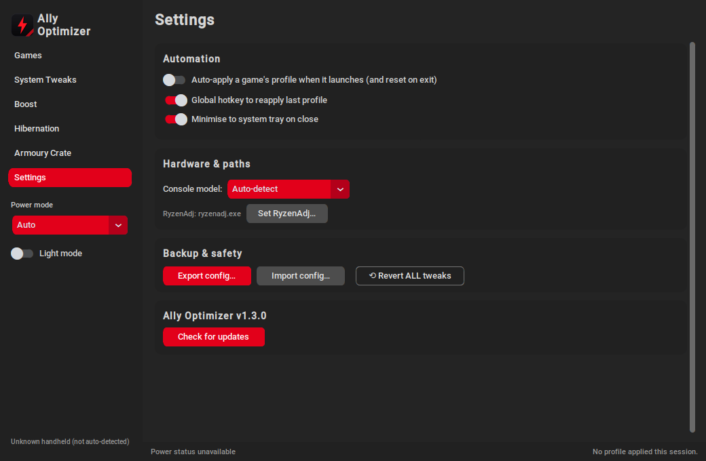
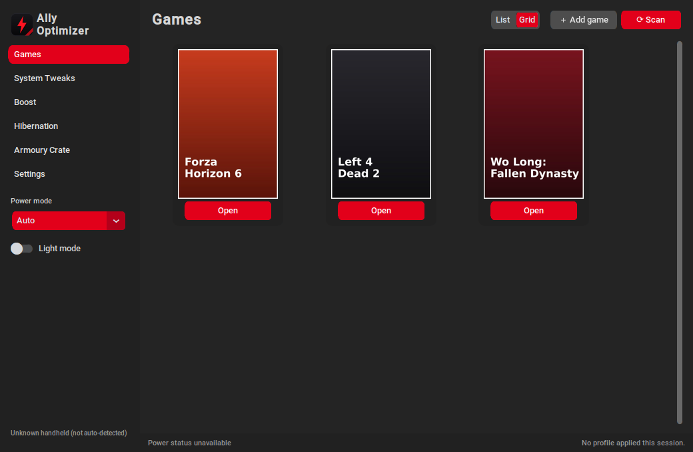
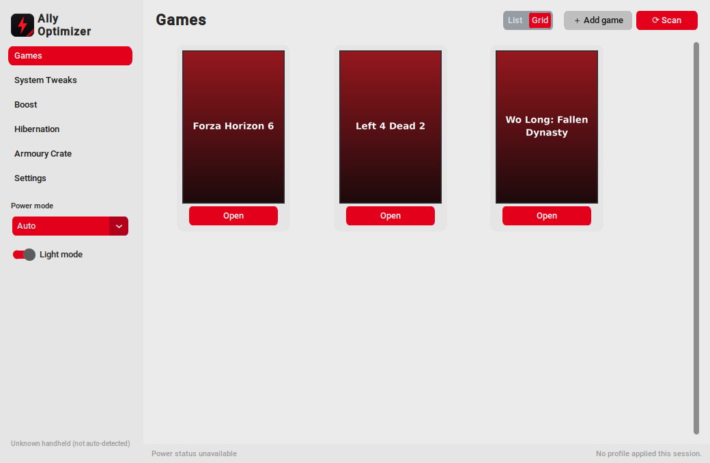

<p align="center">
  
</p>

<h1 align="center">Ally Optimizer</h1>

A one-click optimiser for the **ROG Xbox Ally** and **ROG Xbox Ally X**
(AMD Z2 / Z2 Extreme APU) on Windows 11. Set per-game TDP profiles, apply the
Windows tweaks people recommend for handhelds (reversibly), boost FPS, fix the
overnight sleep drain, and follow a guided Armoury Crate checklist — all from one
app with a modern dark/light, ROG red/black UI.

### Screenshots

| Games | System Tweaks |
| --- | --- |
|  |  |

| Boost | Hibernation |
| --- | --- |
|  |  |

| Armoury Crate | Settings |
| --- | --- |
|  |  |

| Library grid (cover art) | Library grid (placeholder art) |
| --- | --- |
|  |  |

| Light theme | |
| --- | --- |
|  | |

## Tabs

- **Games** — per-game power/performance profiles applied via
  [RyzenAdj](https://github.com/FlyGoat/RyzenAdj). Each game shows **cover art**
  (auto-fetched for Steam titles), profiles are **validated against your console**
  (TDP band, native 1080p panel, 120Hz cap) with ✓/⚠ badges, and you can
  **import settings** by pasting a PCGamingWiki/guide link or copied text.
- **System Tweaks** — reversible Windows optimisation tweaks (power, gaming,
  latency, visuals, debloat) with risk badges and one-click revert.
- **Boost** — native AMD AFMF/RSR/FSR guidance, a per-game Fullscreen-Exclusive
  toggle, and detect/launch for Lossless Scaling + AnyFSE.
- **Hibernation** — enable/disable, hibernate-instead-of-sleep, auto-hibernate
  timeout, and hibernate-now (fixes overnight battery drain).
- **Armoury Crate** — guided checklist + deep links (Armoury Crate has no public
  API, so these can't be toggled directly).
- **Settings** — auto-apply-on-launch, hotkey/tray toggles, console-model
  override, RyzenAdj path, config backup/restore, "revert all tweaks", and an
  update check.

Extras: **auto-apply on game launch** (and reset on exit), **quick presets**
(Silent/Balanced/Turbo/Max scaled to your model), **battery-life estimates**,
**list/grid library** with cover art (and generated **placeholder art** when no
cover is found), a **TDP slider**, optional **display-resolution apply**,
**config export/import**, an **update checker**, **gamepad navigation** (Xbox
controller: D-pad to move, A to select, LB/RB to switch tabs), and a first-run
**welcome** guide.

## Features

- **Auto-detects Ally vs Ally X** (model string + RAM) and tunes the recommended
  TDP band per model; manual override via `device_override` in config.
- **Dark & light themes** — toggle in the toolbar (remembered between launches).
- **System Tweaks** — the "power-user" set commonly recommended for handhelds:
  High Performance power plan, disable hibernation/USB-suspend, Game Mode,
  disable Game DVR, HAGS, MPO fix, MMCSS/network-throttling/foreground-priority,
  visual-effects-for-performance, telemetry/SysMain off, and a curated debloat.
  **Every tweak is reversible** — Apply records the prior value, Revert restores
  it, and you can drop a **System Restore point** first.
- **Game list** from `profiles/games.json` plus an **installed-games scan** of
  Steam, Xbox/Game Pass, Epic, GOG, and a catch-all Windows registry + Start-menu
  sweep (covers EA, Ubisoft, Battle.net and standalone installers).
- **Profile buttons** — each game's saved profiles (TDP sustained/boost,
  resolution, FPS cap, notes) as one-click Apply buttons.
- **Apply via RyzenAdj** — converts watts → milliwatts and sets the sustained
  (`--stapm-limit` / `--slow-limit`) and boost (`--fast-limit`) power limits,
  with a safety clamp on wattage.
- **Battery / Plugged toggle** — `Auto` follows the charger; `Battery` flattens
  boost down to the sustained value for quieter, cooler runs.
- **Add / Edit game form** — writes new games and profiles straight back to
  `games.json`.
- **Find settings** — opens browser lookups for the selected game (ROG Ally Life,
  rogally.games, generic web search). *Manual lookups only — the app never
  scrapes these sites.*
- **PCGamingWiki suggestions** — for a game with no saved profile, derives an
  *algorithmic starting guess* from objective facts (FSR support, Steam Deck
  status) via the public PCGamingWiki API. Clearly labelled "untested".
- **Reset** to a safe default power limit.
- **System tray** (minimize-to-tray) and a **global hotkey** to reapply the last
  profile.
- **Status bar** — battery %, plugged state, and CPU temperature via `psutil`.
- **Auto-apply on launch** — a background watcher sets a game's profile when its
  process starts and resets on exit (toggle in Settings).
- **Quick presets** — Silent / Balanced / Turbo / Max, scaled to your model.
- **Profile validation** — ✓/⚠ badges flag a profile that won't suit your
  console (TDP over the model band, resolution above the 1080p panel, FPS > 120).
- **Cover art** — auto-fetched for Steam games (cached); games without art get a
  generated grey gradient placeholder with the title. **List or grid** library.
- **Auto-fill all** — one button to fetch cover art for the whole library and
  suggest a starting profile (PCGamingWiki API) for any game without one. Runs in
  the background, keeps your existing profiles, and labels suggestions untested.
- **Import settings** — paste a PCGamingWiki/guide link or copied settings text
  in the Add/Edit dialog to fill TDP / resolution / FPS (with a clear warning
  before any non-API web fetch — see the no-scraping note below).
- **Battery-life estimates**, a **TDP slider**, and optional **display-resolution
  apply** when a profile is applied.
- **Gamepad navigation** — drive the whole app with an Xbox controller
  (D-pad/stick to move focus, A to select, B back to Games, LB/RB to switch
  tabs). Toggle in Settings; uses Windows XInput, no extra dependency.
- **Config backup / restore** (zip) and a one-click **revert all tweaks**.
- **Update checker** against GitHub Releases, and a first-run **welcome** guide.

## Requirements

- Windows 11 (the Ally's OS). Admin rights — the app self-elevates via UAC
  because RyzenAdj needs them.
- Python 3.10+ with Tkinter (included in the python.org Windows installer).
- Python packages: `pip install -r requirements.txt` —
  `customtkinter` (modern UI) and `Pillow` (cover art) are needed; `psutil`
  (battery/auto-apply), `pystray` (tray) and `keyboard` (hotkey) are optional
  and the app degrades gracefully without them.
- **Or skip all of this** and download the pre-built `.exe` from
  [Releases](https://github.com/KTO1996/Ally-Optimiser/releases) — no Python
  needed.

## RyzenAdj setup (required, not bundled)

RyzenAdj is **not included** in this repo. It's a separate GPL tool that does the
actual power-limit setting.

1. Download a RyzenAdj release from the official project:
   <https://github.com/FlyGoat/RyzenAdj/releases>
2. Unzip it and copy **all** of its files together (e.g. into
   `C:\Tools\RyzenAdj\`). **`ryzenadj.exe` needs `WinRing0x64.dll` and
   `WinRing0x64.sys` in the same folder** — copying only the `.exe` will make
   Apply fail with a driver error.
3. In the app, click **RyzenAdj…** and point it at `ryzenadj.exe`
   (this saves the path into `profiles/config.json`). Or edit
   `"ryzenadj_path"` in that file directly.

If RyzenAdj isn't found, the app runs in **dry-run mode**: Apply shows you the
exact command it *would* run instead of failing, so you can still explore the UI.

### "Windows Defender / SmartScreen flagged it"

RyzenAdj.exe is **unsigned**, so Windows SmartScreen and Microsoft Defender may
warn about it (an unrecognized publisher) — this is expected for the unsigned
binary, not a sign the app did anything to it. **This app does not, and will
not, try to suppress or bypass that warning.** Verify you downloaded RyzenAdj
from the official link above, then allow it through if you trust it. Setting
APU power limits is also why admin rights are needed.

> ⚠️ Changing power limits affects your hardware. The clamp keeps values in a
> sane band, but use sensible numbers. This tool is provided as-is.

## First run on the Ally — sanity check

The logic, UI and read-only Windows calls are validated automatically on a
Windows CI runner, but the parts that actually touch hardware can only be
confirmed on the device. Run through this once on your Ally:

1. **Launch & elevate** — start the app, accept the UAC prompt. The sidebar
   should show your model (e.g. *ROG Ally X*) and the status bar should show a
   real battery % / plugged state. _(If the model says "Unknown handheld", set
   `device_override` in `profiles/config.json` to `"ROG Ally"` or `"ROG Ally X"`.)_
2. **TDP apply (RyzenAdj)** — point the app at `ryzenadj.exe`, pick a game, and
   Apply a profile. Confirm it reports success (not dry-run). Sanity-check the
   wattage actually changed in your monitoring overlay / Armoury Crate.
3. **One tweak + revert** — on **System Tweaks**, click **🛡 Create restore
   point** first, then Apply a single *SAFE* tweak (e.g. *Disable hibernation*),
   confirm the "● applied" badge, then **Revert** and confirm it clears. This
   proves the apply→record→revert round-trip works on your machine.
4. **Hibernation** — on the **Hibernation** page, check the state line reads
   correctly, try **Buttons → hibernate** then **Buttons → sleep** to confirm
   both directions work. *(Test "Hibernate now" only when you're ready for the
   Ally to actually hibernate.)*
5. **Boost / FSE** — pick a game's `.exe` with **Force FSE for .exe…**, then
   **Remove FSE for .exe…**, to confirm the per-game Fullscreen-Exclusive toggle
   writes and clears. AFMF/RSR/FSR are guidance — enable those in AMD Software.

If any **write** action fails, it'll surface the exact command and error rather
than failing silently — note that down so it can be fixed. Everything is
reversible, and the restore point from step 3 is your safety net.

## Build a standalone .exe (recommended for the Ally)

So you can just double-click an icon on the Ally instead of running Python, build
a standalone `AllyOptimizer.exe` with [PyInstaller](https://pyinstaller.org).

> A Windows `.exe` must be built **on Windows** (PyInstaller can't cross-compile).
> Build it once on the Ally itself, or on any Windows PC, then copy the folder.

```bat
build_exe.bat
```

That installs the dependencies + PyInstaller and runs the bundled
`AllyOptimizer.spec`. When it finishes you'll have:

```
dist\AllyOptimizer\AllyOptimizer.exe
dist\AllyOptimizer\profiles\        (your editable games.json / config.json)
```

Then:

1. Drop `ryzenadj.exe` into `dist\AllyOptimizer\` (or point the app at it via the
   **RyzenAdj…** button).
2. Right-click `AllyOptimizer.exe` → **Send to → Desktop (create shortcut)**, or
   pin it to Start. Double-click to launch (it'll prompt for admin via UAC).

The exe is built with `uac_admin`, so Windows asks for Administrator rights on
launch — that's required for RyzenAdj. SmartScreen may warn about your freshly
built, unsigned exe (same as RyzenAdj); that's expected for an unsigned binary.

### Or download a pre-built exe (no Python needed)

A GitHub Actions workflow builds the exe on a Windows runner automatically:

- **Every push to `main`** uploads `AllyOptimizer-windows.zip` as a build
  artifact (Actions tab → latest run → Artifacts).
- **Publishing a release** (exe attached) happens one of two ways:
  - push a tag: `git tag v1.4.0 && git push origin v1.4.0`, or
  - **Actions → "Build Windows exe" → Run workflow**, and enter a version like
    `v1.4.0` (handy if tag pushes are restricted).

Before building, CI also runs the test suite **and launches the app on the
Windows runner** (`python main.py --smoke`) so a broken build can't reach a
release.

Download the zip on the Ally, unzip it, drop `ryzenadj.exe` in the folder, and
double-click `AllyOptimizer.exe`. No Python install required.

## Run from source (for development)

```sh
pip install -r requirements.txt
python main.py
```

Accept the UAC prompt (needed for RyzenAdj). Then:

1. **Scan installed games** to merge detected installs into the list.
2. Select a game. If it has profiles, click one to **Apply**. If not, use
   **Add profile** or **Suggest from PCGamingWiki**, or **Find settings** to look
   up tested numbers and enter them yourself.
3. Use the **Power** dropdown to bias toward battery or plugged-in behaviour.
4. **Reset to default** restores a safe baseline limit.

## Adding games manually

Use the **＋ Add game** / **✎ Edit game** buttons, or edit `profiles/games.json`
directly. Each game has a `process_name`, a `source` note, and a list of
`profiles`, where each profile has `label`, `tdp_sustained`, `tdp_boost`,
`resolution`, `fps_cap`, and `notes`. The file is yours — add freely.

## How "Find settings" works (and why there's no scraping)

The Find settings dropdown just opens search URLs in your browser for the
selected game. It's the intended path to pull in real, human-tested numbers:
read the page, then type the values into the Add/Edit form.

The app deliberately **does not** bulk-scrape or auto-import from ROG Ally Life,
rogally.games, or similar settings databases (including their `wp-json`
endpoints). Those are community resources; automated bulk access typically
violates their terms and is unkind to small sites. For *automated* suggestions
the app uses the PCGamingWiki API instead (public, CC BY-NC-SA, attributed),
which produces an algorithmic starting guess from objective facts — not copied
tested values.

## Project layout

```
main.py               entry point, admin self-elevation, --smoke self-test
app/gui.py            CustomTkinter UI (sidebar shell, all pages, dialogs)
app/__init__.py       app name + version

  Power / games
app/ryzenadj.py       command building, apply/reset, W->mW, clamps, dry-run
app/scanners.py       Steam/Xbox/Epic/GOG/registry/Start-menu scanners
app/profiles.py       games.json load/save
app/config.py         config.json load/save + defaults
app/power.py          psutil battery/temp readout
app/sysinfo.py        Ally vs Ally X detection + per-model profile validation
app/presets.py        Silent/Balanced/Turbo/Max presets
app/batteryest.py     rough battery-runtime estimates
app/watcher.py        auto-apply-on-launch process watcher

  Optimisation
app/systweaks.py      reversible Windows tweak catalogue
app/tweakengine.py    apply/revert engine + restore point + revert-all
app/hibernate.py      hibernation controls (powercfg)
app/boost.py          AFMF/RSR/FSR guidance, FSE toggle, app detect/launch
app/armoury.py        Armoury Crate checklist + deep links
app/display.py        display resolution/refresh apply + restore (ctypes)
app/wincmd.py         shared dry-run-aware Windows command runner

  Content / UX
app/covers.py         cover-art fetch/cache + generated placeholders
app/importer.py       import a profile from pasted text or a link
app/pcgamingwiki.py   algorithmic suggestion via PCGamingWiki API
app/weblinks.py       Find-settings browser links
app/backup.py         export/import config as a zip
app/updates.py        GitHub-releases update check
app/gamepad.py        Xbox-controller (XInput) navigation
app/tray.py           system tray (optional)
app/hotkey.py         reapply-last global hotkey (optional)

assets/               icon + screenshots (bundled into the exe)
profiles/             games.json + config.json (yours to edit)
tools/make_icon.py    regenerate the app icon
tools/render_screens.py  headless screenshot renderer
tests/test_logic.py   tests for the pure-Python logic
AllyOptimizer.spec    PyInstaller build spec
.github/workflows/    Windows build + test + smoke + release
```

## Tests & validation

```sh
python tests/test_logic.py      # or: python -m pytest
```

36 tests cover the platform-independent logic: W→mW conversion, clamps and
command building, `.acf` parsing, model detection and profile validation, the
tweak catalogue and dry-run apply/revert round-trip, settings import parsing,
battery/preset/update/backup/gamepad helpers, and more. On top of that, **CI
runs these on a real Windows runner and launches the app** (building every page)
so packaging or Windows-only regressions fail the build. The remaining
hardware-touching actions (RyzenAdj TDP, `powercfg`, registry writes, AMD
features) are confirmed on the device via the checklist above.

## License / credits

- RyzenAdj — GPL, © its authors. Downloaded separately, not redistributed here.
- Game-fact suggestions — PCGamingWiki, CC BY-NC-SA.
- Seed profile numbers in `games.json` — illustrative examples sourced from
  rogallylife.com.
