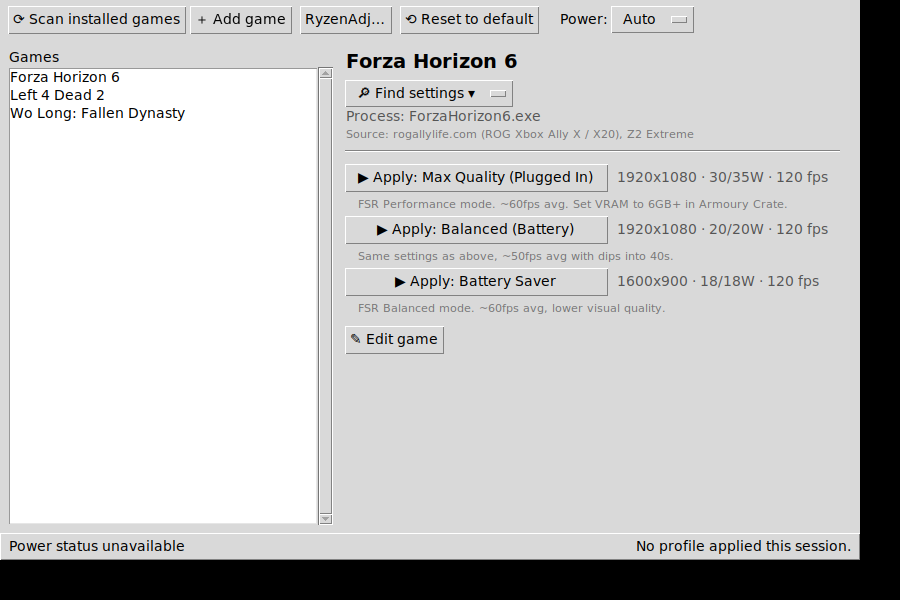

# Ally Optimizer

A one-click per-game power/performance profile switcher for the **ROG Xbox Ally**
(AMD Z2 / Z2 Extreme APU) on Windows 11. Pick a game, hit a profile button, and
the app sets the APU's TDP via [RyzenAdj](https://github.com/FlyGoat/RyzenAdj) —
no fiddling in Armoury Crate every time.



## Features

- **Game list** from `profiles/games.json` plus an **installed-games scan** of
  Steam, Xbox/Game Pass, Epic, GOG, and a catch-all Windows registry + Start-menu
  sweep (covers EA, Ubisoft, Battle.net and standalone installers).
- **Profile buttons** — each game's saved profiles (TDP sustained/boost,
  resolution, FPS cap, notes) as one-click Apply buttons.
- **Apply via RyzenAdj** — converts watts → milliwatts and sets the sustained
  (`--stapm-limit` / `--slow-limit`) and boost (`--fast-limit`) power limits,
  with a safety clamp on wattage.
- **Battery / Plugged toggle** — `Auto` follows the charger; `Battery` flattens
  boost down to the sustained value for quieter, cooler runs.
- **Add / Edit game form** — writes new games and profiles straight back to
  `games.json`.
- **Find settings** — opens browser lookups for the selected game (ROG Ally Life,
  rogally.games, generic web search). *Manual lookups only — the app never
  scrapes these sites.*
- **PCGamingWiki suggestions** — for a game with no saved profile, derives an
  *algorithmic starting guess* from objective facts (FSR support, Steam Deck
  status) via the public PCGamingWiki API. Clearly labelled "untested".
- **Reset** to a safe default power limit.
- **System tray** (minimize-to-tray) and a **global hotkey** to reapply the last
  profile.
- **Status bar** — battery %, plugged state, and CPU temperature via `psutil`.

## Requirements

- Windows 11 (the Ally's OS). Admin rights — the app self-elevates via UAC
  because RyzenAdj needs them.
- Python 3.10+ with Tkinter (included in the python.org Windows installer).
- Python packages: `pip install -r requirements.txt`
  (`psutil`, plus optional `pystray`/`Pillow` for the tray and `keyboard` for the
  hotkey — the app runs fine without the optional ones).

## RyzenAdj setup (required, not bundled)

RyzenAdj is **not included** in this repo. It's a separate GPL tool that does the
actual power-limit setting.

1. Download a RyzenAdj release from the official project:
   <https://github.com/FlyGoat/RyzenAdj/releases>
2. Unzip it somewhere (e.g. `C:\Tools\RyzenAdj\ryzenadj.exe`).
3. In the app, click **RyzenAdj…** and point it at `ryzenadj.exe`
   (this saves the path into `profiles/config.json`). Or edit
   `"ryzenadj_path"` in that file directly.

If RyzenAdj isn't found, the app runs in **dry-run mode**: Apply shows you the
exact command it *would* run instead of failing, so you can still explore the UI.

### "Windows Defender / SmartScreen flagged it"

RyzenAdj.exe is **unsigned**, so Windows SmartScreen and Microsoft Defender may
warn about it (an unrecognized publisher) — this is expected for the unsigned
binary, not a sign the app did anything to it. **This app does not, and will
not, try to suppress or bypass that warning.** Verify you downloaded RyzenAdj
from the official link above, then allow it through if you trust it. Setting
APU power limits is also why admin rights are needed.

> ⚠️ Changing power limits affects your hardware. The clamp keeps values in a
> sane band, but use sensible numbers. This tool is provided as-is.

## Usage

```sh
pip install -r requirements.txt
python main.py
```

Accept the UAC prompt (needed for RyzenAdj). Then:

1. **Scan installed games** to merge detected installs into the list.
2. Select a game. If it has profiles, click one to **Apply**. If not, use
   **Add profile** or **Suggest from PCGamingWiki**, or **Find settings** to look
   up tested numbers and enter them yourself.
3. Use the **Power** dropdown to bias toward battery or plugged-in behaviour.
4. **Reset to default** restores a safe baseline limit.

## Adding games manually

Use the **＋ Add game** / **✎ Edit game** buttons, or edit `profiles/games.json`
directly. Each game has a `process_name`, a `source` note, and a list of
`profiles`, where each profile has `label`, `tdp_sustained`, `tdp_boost`,
`resolution`, `fps_cap`, and `notes`. The file is yours — add freely.

## How "Find settings" works (and why there's no scraping)

The Find settings dropdown just opens search URLs in your browser for the
selected game. It's the intended path to pull in real, human-tested numbers:
read the page, then type the values into the Add/Edit form.

The app deliberately **does not** bulk-scrape or auto-import from ROG Ally Life,
rogally.games, or similar settings databases (including their `wp-json`
endpoints). Those are community resources; automated bulk access typically
violates their terms and is unkind to small sites. For *automated* suggestions
the app uses the PCGamingWiki API instead (public, CC BY-NC-SA, attributed),
which produces an algorithmic starting guess from objective facts — not copied
tested values.

## Project layout

```
main.py              entry point + admin self-elevation
app/gui.py           Tkinter UI
app/ryzenadj.py      command building, apply/reset, W->mW, clamps, dry-run
app/scanners.py      Steam/Xbox/Epic/GOG/registry/Start-menu scanners
app/profiles.py      games.json load/save
app/config.py        config.json load/save
app/power.py         psutil battery/temp readout
app/pcgamingwiki.py  algorithmic suggestion via PCGamingWiki API
app/weblinks.py      Find-settings browser links
app/tray.py          system tray (optional)
app/hotkey.py        reapply-last global hotkey (optional)
profiles/            games.json + config.json (yours to edit)
tests/test_logic.py  smoke tests for the pure-Python logic
```

## Tests

```sh
python tests/test_logic.py      # or: python -m pytest
```

Tests cover the platform-independent logic (W→mW conversion, clamps, command
building, `.acf` parsing, web-link building, seed JSON validity). The GUI,
RyzenAdj execution, and Windows-only scanners are exercised on the device.

## License / credits

- RyzenAdj — GPL, © its authors. Downloaded separately, not redistributed here.
- Game-fact suggestions — PCGamingWiki, CC BY-NC-SA.
- Seed profile numbers in `games.json` — illustrative examples sourced from
  rogallylife.com.
